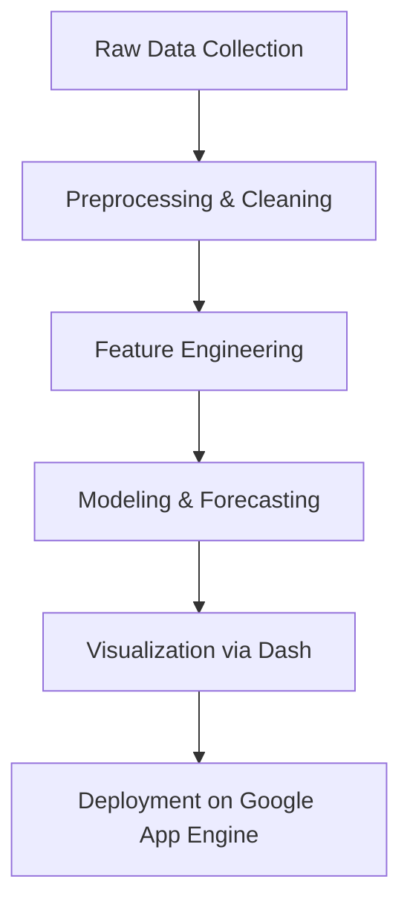

# 🚨 Crime Trends & Emergency Call Analysis in San Jose

This project explores and visualizes patterns in 911 emergency calls in San Jose from 2013 to 2024. It investigates how external factors such as weather, unemployment, income, CPI, and poverty correlate with call volume and public safety risk. The results are presented in an interactive web dashboard.

🔗 **Live Website:** [https://cs163-seniorproject.appspot.com](https://cs163-seniorproject.appspot.com)

---

## ⚙️ Setup Instructions in app folder

### ✅ Requirements

- Python 3.9+
- pip (Python package manager)
- (Recommended) Virtual environment tool: `venv` or `conda`

### 📦 Install Dependencies

```bash
pip install -r requirements.txt
```

### ▶️ Run Locally

```bash
cd app
python app.py
```

> Make sure you have an internet connection to access data from Google Cloud Storage (GCS).

---

## 🔁 Project Pipeline



### 1. **Data Collection**
- Datasets were collected from SJPD, NOAA, BLS, and census sources.
- Stored on Google Cloud Storage (GCS) and accessed by the app.

### 2. **Preprocessing**
- Cleaned and joined 911, weather, CPI, income, poverty, and unemployment datasets.
- Final cleaned versions uploaded to GCS.

### 3. **Feature Engineering**
- Created features like weekend/holiday flags, hot/storm days, lagged call volumes, and economic indicators.

### 4. **Modeling**
- Trained Random Forest and Gradient Boosting models to predict 911 call volume based on external factors.
- Ensemble predictions were compared using R².

### 5. **Dashboard & Visualization**
- Built with Plotly Dash.
- Interactive maps, charts, and trends.
- Accessible via browser.

### 6. **Deployment**
- Hosted on Google App Engine.
- App fetches all data dynamically from public GCS URLs.

---

## 📁 Repository Structure

```
.
├── app/                # Dash app logic 
│   ├── pages/          # Multi-page views for routing
│   ├── static/         # picture or icons used in Dash
│   ├── requirements.txt    # All project dependencies
│   └── app.yaml            # GAE deployment config
├── src/                # Processing modules (preprocessing, modeling, plotting)
│   ├── preprocessing/  # Scripts to clean and prepare datasets
│   ├── methods/        # Modeling and feature extraction
│   └── results/        # Visualization and summary output generators
├── data/              # GCS links, data catalog
└── README.md           # This file
```

---

## 📦 Key Files and Modules

| File/Folder        | Purpose |
|--------------------|---------|
| `app/app.py`       | Main Dash entry point |
| `src/preprocessing/` | Weather, CPI, and call data cleaning |
| `src/methods/`     | ML model training and prediction |
| `src/results/`     | Plots and result generation |
| `data/README.md`   | Links to full datasets hosted on GCS |

